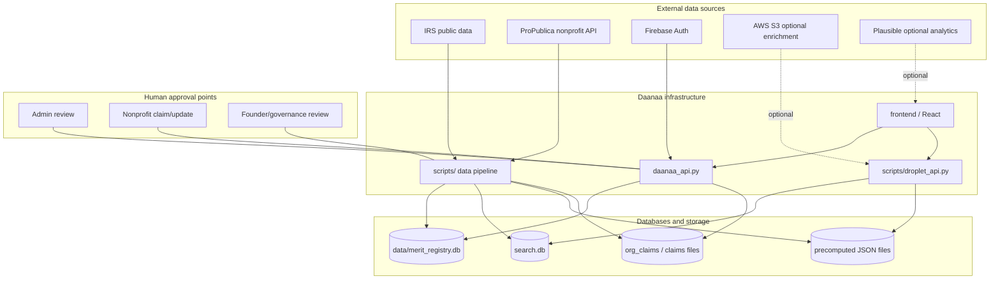

# Platform Architecture

```mermaid
flowchart TB
  subgraph External["External data sources"]
    IRS[IRS public data]
    PROP[ProPublica nonprofit API]
    FIREBASE[Firebase Auth]
    S3[AWS S3 optional enrichment]
    PLAUSIBLE[Plausible optional analytics]
  end

  subgraph Core["Daanaa infrastructure"]
    API[daanaa_api.py]
    DROPLET[scripts/droplet_api.py]
    FE[frontend / React]
    SCRIPTS[scripts/ data pipeline]
  end

  subgraph Data["Databases and storage"]
    REG[(data/merit_registry.db)]
    SEARCH[(search.db)]
    PRE[(precomputed JSON files)]
    CLAIMS[(org_claims / claims files)]
  end

  subgraph Human["Human approval points"]
    ADMIN[Admin review]
    NONPROFIT[Nonprofit claim/update]
    FOUNDER[Founder/governance review]
  end

  IRS --> SCRIPTS
  PROP --> SCRIPTS
  SCRIPTS --> REG
  SCRIPTS --> SEARCH
  SCRIPTS --> PRE
  SCRIPTS --> CLAIMS

  FE --> API
  FE --> DROPLET
  DROPLET --> SEARCH
  DROPLET --> PRE
  API --> REG
  API --> CLAIMS
  FIREBASE --> API
  S3 -. optional .-> DROPLET
  PLAUSIBLE -. optional .-> FE

  ADMIN --- API
  NONPROFIT --- API
  FOUNDER --- SCRIPTS
```

