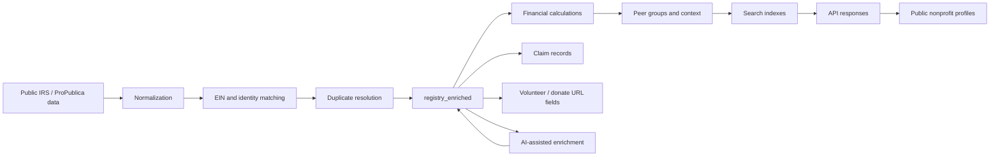

# Complete Data Lineage

```mermaid
flowchart LR
  A[Public IRS / ProPublica data] --> B[Normalization]
  B --> C[EIN and identity matching]
  C --> D[Duplicate resolution]
  D --> E[registry_enriched]
  E --> F[Financial calculations]
  F --> G[Peer groups and context]
  G --> H[Search indexes]
  H --> I[API responses]
  I --> J[Public nonprofit profiles]
  E --> K[Claim records]
  E --> L[Volunteer / donate URL fields]
  E --> M[AI-assisted enrichment]
  M --> E
```

