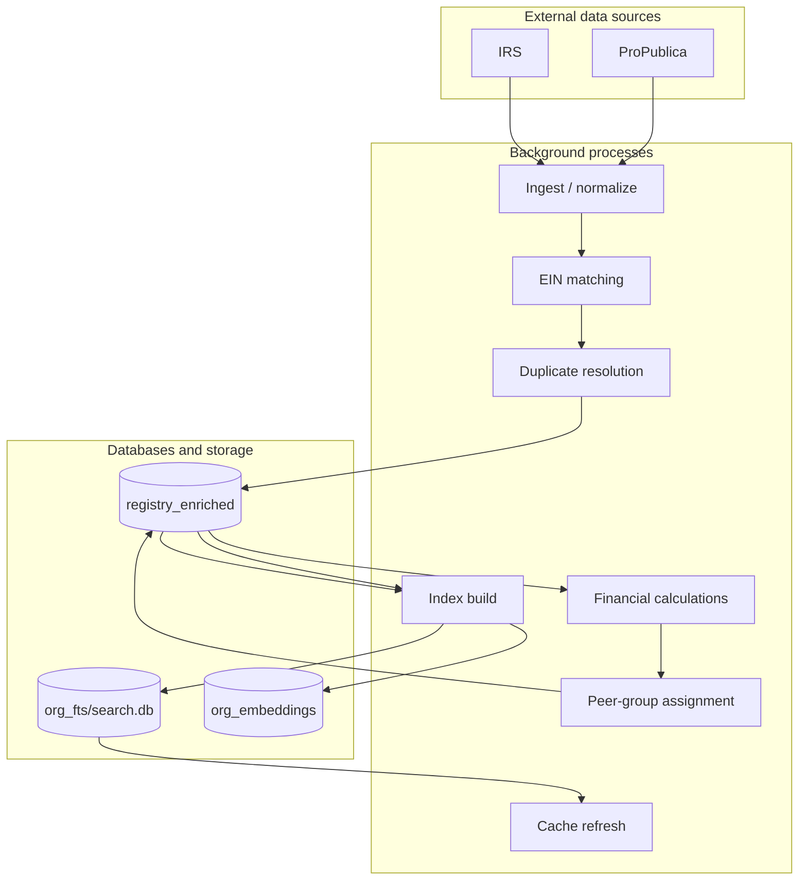

# Nonprofit Data Pipeline

```mermaid
flowchart TB
  subgraph Source["External data sources"]
    IRS[IRS]
    PRO[ProPublica]
  end
  subgraph Work["Background processes"]
    INGEST[Ingest / normalize]
    MATCH[EIN matching]
    DEDUPE[Duplicate resolution]
    SCORE[Financial calculations]
    PEER[Peer-group assignment]
    INDEX[Index build]
    CACHE[Cache refresh]
  end
  subgraph Store["Databases and storage"]
    DB[(registry_enriched)]
    FTS[(org_fts/search.db)]
    VEC[(org_embeddings)]
  end

  IRS --> INGEST
  PRO --> INGEST
  INGEST --> MATCH --> DEDUPE --> DB
  DB --> SCORE --> PEER --> DB
  DB --> INDEX --> FTS
  DB --> INDEX --> VEC
  FTS --> CACHE
```

