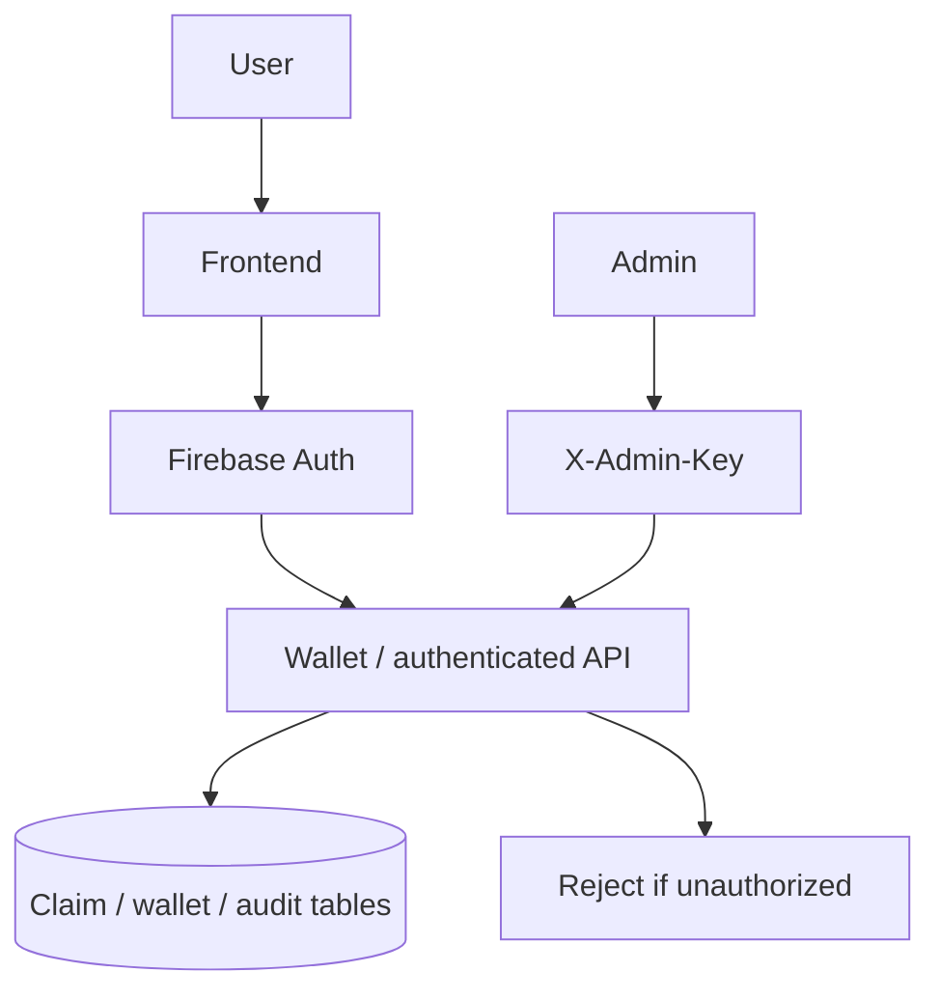

# Authentication and Authorization

```mermaid
flowchart TB
  U[User] --> FE[Frontend]
  FE --> FB[Firebase Auth]
  FB --> API[Wallet / authenticated API]
  ADMIN[Admin] --> KEY[X-Admin-Key]
  KEY --> API
  API --> DB[(Claim / wallet / audit tables)]
  API --> DENY[Reject if unauthorized]
```

