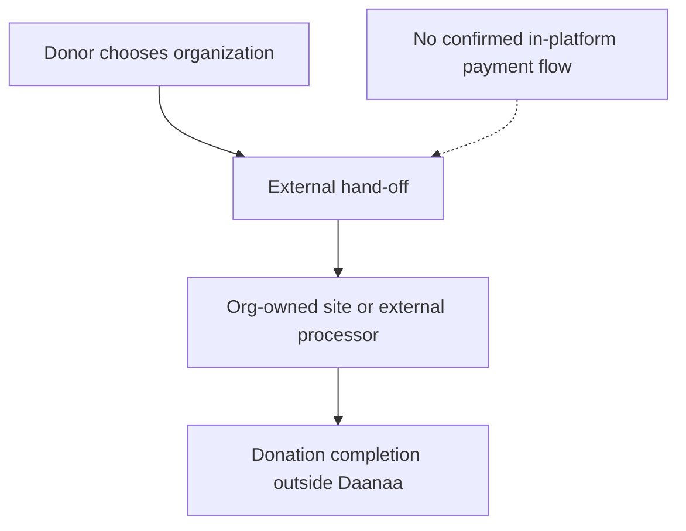

# Payment and Transaction Flow

```mermaid
flowchart TB
  A[Donor chooses organization] --> B[External hand-off]
  B --> C[Org-owned site or external processor]
  C --> D[Donation completion outside Daanaa]
  E[No confirmed in-platform payment flow] -.-> B
```

