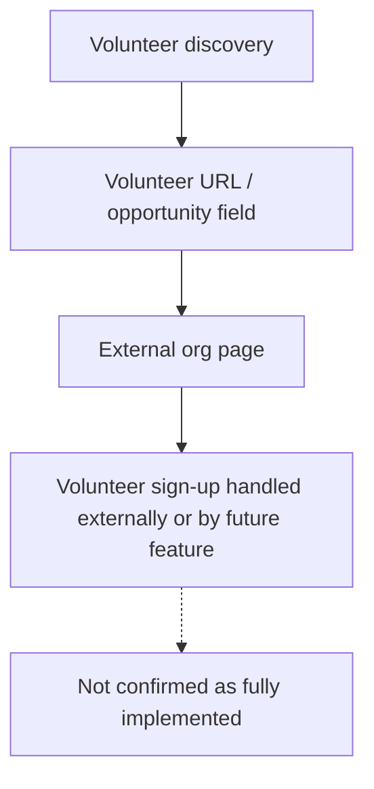

# Volunteer Workflow

```mermaid
flowchart TB
  A[Volunteer discovery] --> B[Volunteer URL / opportunity field]
  B --> C[External org page]
  C --> D[Volunteer sign-up handled externally or by future feature]
  D -.-> E[Not confirmed as fully implemented]
```

