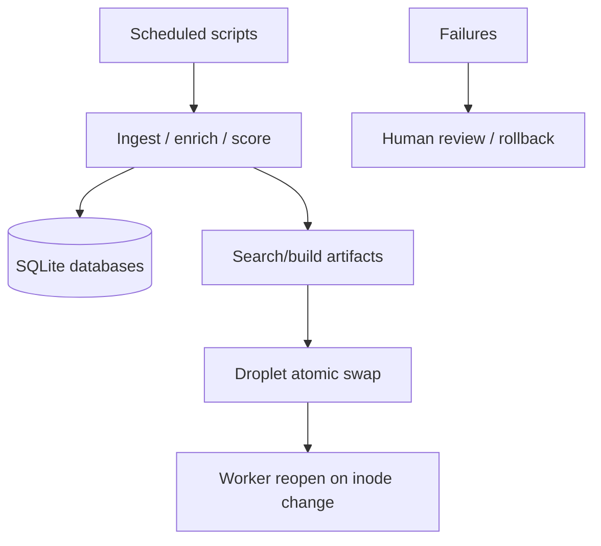

# Background Jobs and Recovery

```mermaid
flowchart TB
  S[Scheduled scripts] --> I[Ingest / enrich / score]
  I --> R[(SQLite databases)]
  I --> X[Search/build artifacts]
  X --> D[Droplet atomic swap]
  D --> V[Worker reopen on inode change]
  F[Failures] --> H[Human review / rollback]
```

