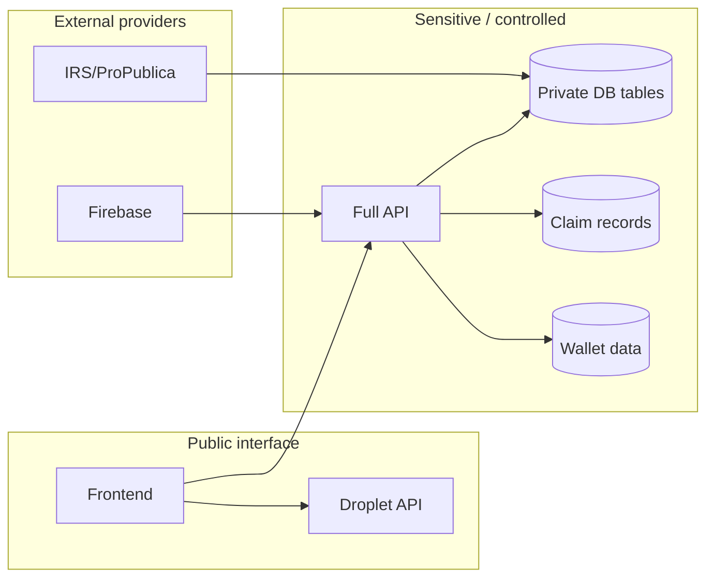

# Trust Boundaries

```mermaid
flowchart LR
  subgraph Public["Public interface"]
    FE[Frontend]
    DROPLET[Droplet API]
  end
  subgraph Sensitive["Sensitive / controlled"]
    API[Full API]
    DB[(Private DB tables)]
    CLAIMS[(Claim records)]
    WALLET[(Wallet data)]
  end
  subgraph External["External providers"]
    FIREBASE[Firebase]
    IRS[IRS/ProPublica]
  end

  FE --> DROPLET
  FE --> API
  API --> DB
  API --> CLAIMS
  API --> WALLET
  IRS --> DB
  FIREBASE --> API
```

