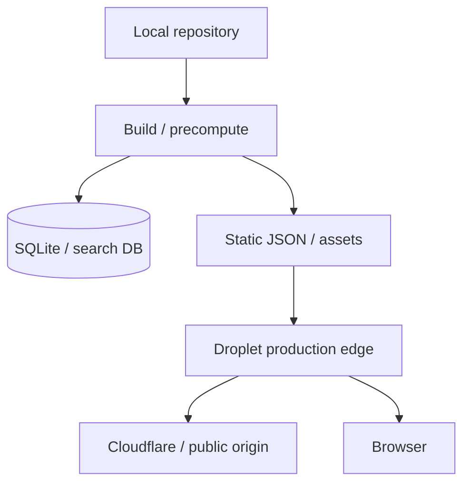

# Deployment and Infrastructure

```mermaid
flowchart TB
  DEV[Local repository] --> BUILD[Build / precompute]
  BUILD --> DB[(SQLite / search DB)]
  BUILD --> PRE[Static JSON / assets]
  PRE --> DO[Droplet production edge]
  DO --> CF[Cloudflare / public origin]
  DO --> USER[Browser]
```

